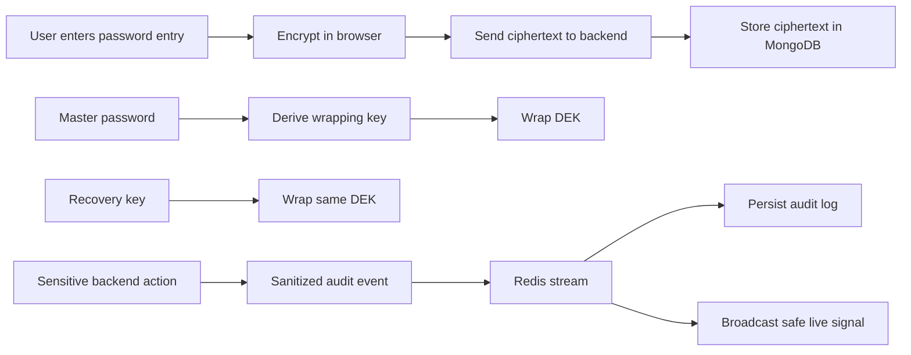

# KeyMate

KeyMate is a browser-encrypted password manager built around a zero-knowledge vault direction. Password entries are encrypted on the client, the backend stores ciphertext only, and the app now includes master-password vault protection, recovery-key support, key rotation, Redis-backed auth protections, audit logging, and live security signals.

## What It Does

- encrypts vault entries in the browser with AES-GCM
- keeps plaintext passwords out of the backend and database
- protects the vault DEK with a master password derived wrapping key
- issues a recovery key for vault recovery
- rotates vault wrapping material without re-encrypting stored entries
- uses Redis for rate limiting, failed-login tracking, reset-token TTL, and audit-stream fanout
- shows recent account security activity in the UI with live safe signals over Socket.IO

## Architecture Snapshot

## Project Areas

- `Frontend/`: React + Vite client, vault crypto flow, live security activity UI
- `Backend/`: Express API, MongoDB models, auth, audit pipeline, Redis-backed protections
- `docs/`: architecture, setup, security, Redis, API, and implementation notes

## Documentation

- [Documentation Index](docs/README.md)
- [Architecture](docs/architecture.md)
- [Setup](docs/setup.md)
- [Security Model](docs/security.md)
- [Redis Guide](docs/redis.md)
- [API Reference](docs/api.md)
- [Frontend Guide](docs/frontend.md)
- [Backend Guide](docs/backend.md)
