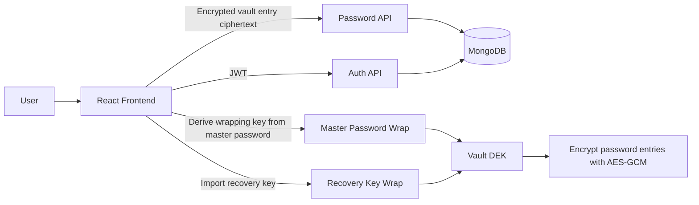
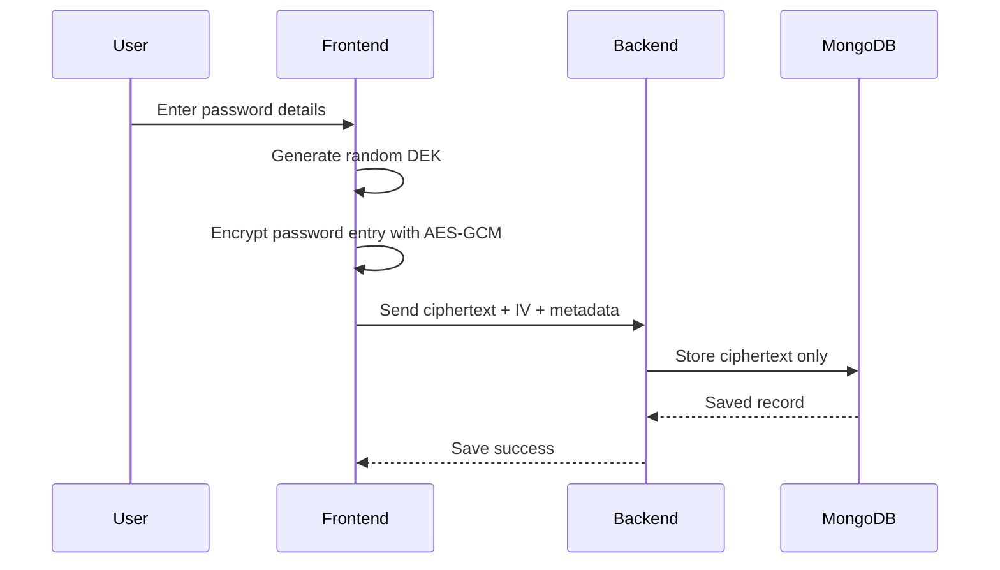
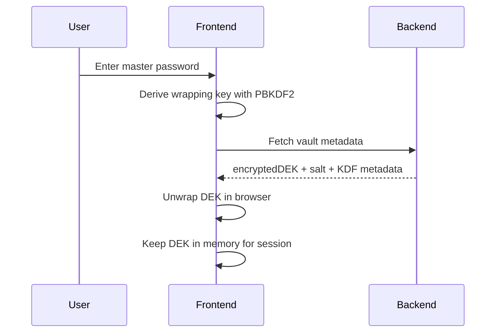
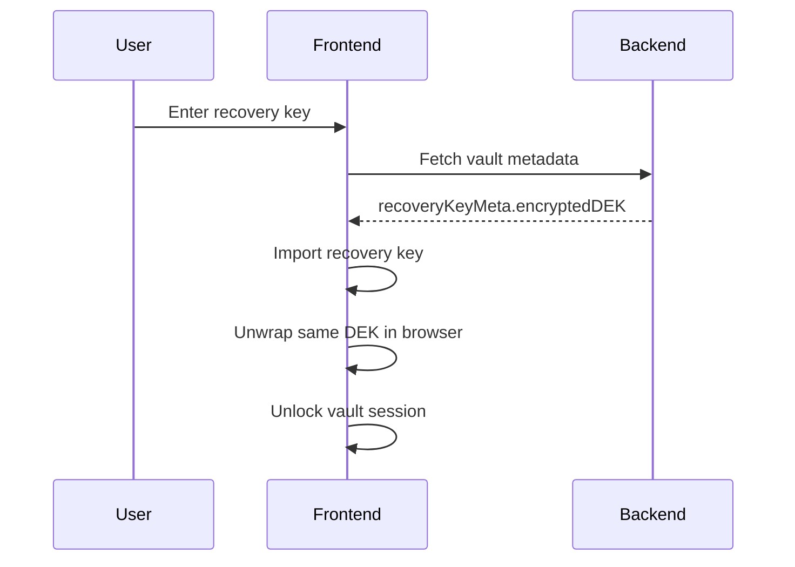
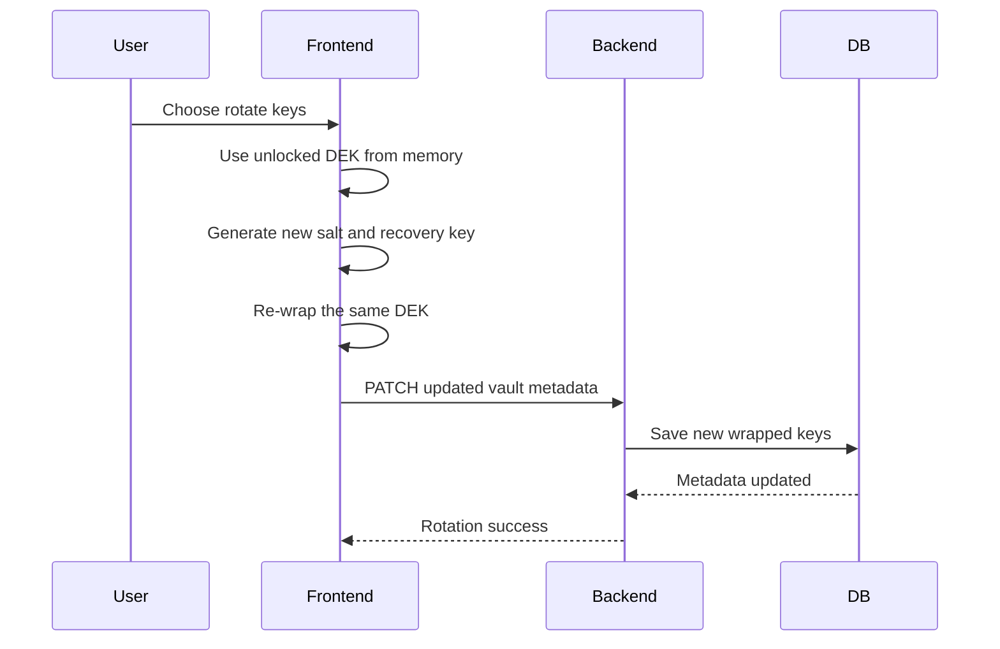
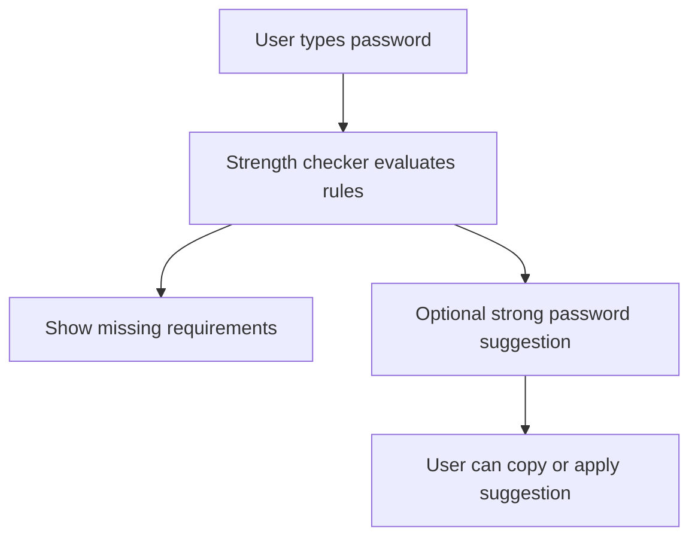
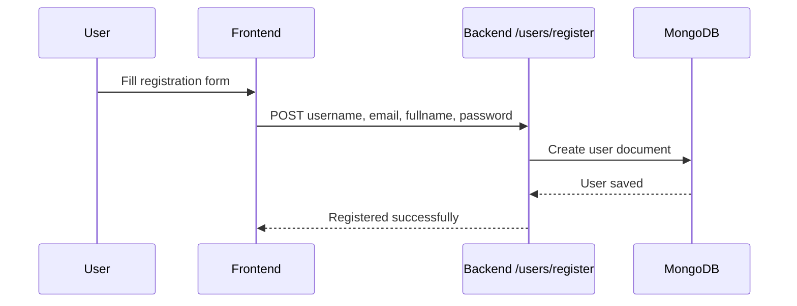
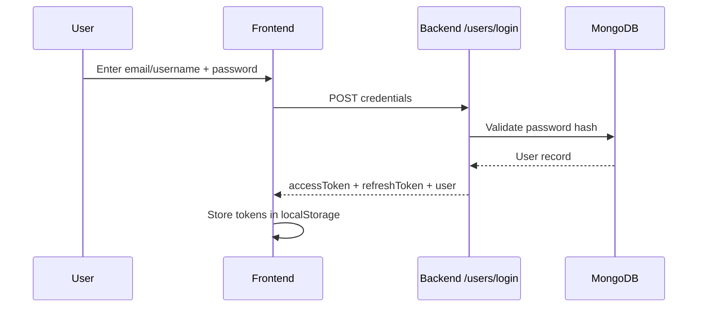
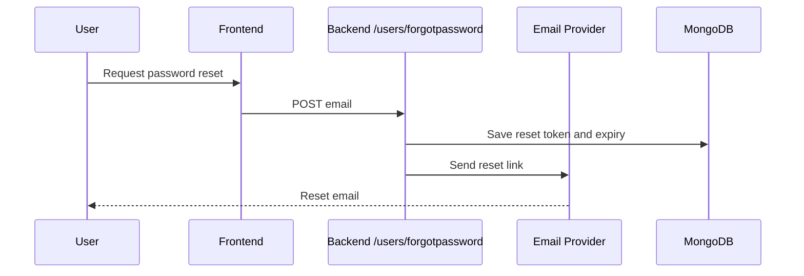

# KeyMate

KeyMate is a password manager built around a **zero-knowledge vault architecture**.

The updated design keeps the sensitive part of the vault encrypted on the client and stores only ciphertext plus vault metadata on the server.

## What This Architecture Does

- Encrypts password entries in the browser before upload.
- Stores only encrypted vault data in MongoDB.
- Uses a **DEK** (Data Encryption Key) to encrypt password entries.
- Protects the DEK with a **master password** and a **recovery key**.
- Supports **key rotation** without changing the encrypted password entries.
- Keeps the vault flow compatible with future multi-device support.

## Tech Stack

- **Frontend:** React, React Router, Redux Toolkit, Tailwind CSS, react-hot-toast
- **Backend:** Node.js, Express.js, MongoDB, Mongoose
- **Crypto:** Web Crypto API, AES-GCM, PBKDF2
- **Authentication:** JWT access and refresh tokens
- **Email:** Nodemailer for forgot-password flow

## High-Level Vault Model



## Vault Architecture

The vault is split into two layers:

1. **Vault data layer**
   - Password entries are encrypted with a random AES-GCM DEK.
   - The DEK is used only on the client.

2. **Key protection layer**
   - The DEK is wrapped using a master-password-derived key.
   - A second wrapped copy of the same DEK is stored for recovery-key unlocks.
   - Rotating keys only re-wraps the DEK; it does not re-encrypt the password entries.

## Vault Flow

### Phase 1: Client-Side Entry Encryption



### Phase 2: Master Password Vault Unlock



### Phase 2 Recovery Key Flow



### Phase 3 Key Rotation



## Password Strength UX

The frontend includes password feedback helpers that:

- show which password rules are missing
- let users reveal the password field
- suggest a stronger random password
- allow quick copy of the current or suggested password



## Authentication Flow

### Registration



### Login



### Forgot Password



## API Routes

### User routes

- `POST /users/register`
- `POST /users/login`
- `POST /users/forgotpassword`
- `POST /users/resetpassword/:token`
- `POST /users/logout`
- `POST /users/refresh-token`
- `GET /users/getcurrentuser`
- `POST /users/vault/setup`
- `GET /users/vault/meta`
- `PATCH /users/vault/rotate`

### Password routes

- `POST /password/addpassword`
- `GET /password/allpasswords`
- `GET /password/getpassword/:passwordID`
- `PATCH /password/updatePassword/:passwordID`
- `DELETE /password/deletePassword/:passwordID`

## Data Stored on the Server

The server stores:

- user profile data
- JWT refresh token
- vault metadata
- encrypted password entries

The server should never store:

- master password
- recovery key
- decrypted DEK
- plaintext password entries

## Why This Is More Secure

- Password entries are encrypted in the browser.
- The same DEK can be re-wrapped without re-encrypting all passwords.
- The recovery key gives account recovery without exposing plaintext vault data.
- Key rotation improves security without changing stored password records.
- The architecture cleanly separates authentication from vault encryption.

## Environment Variables

### Backend

```env
PORT=8000
DB_NAME=Keymate
MONGODB_URI=your_mongodb_connection_string
CORS_ORIGIN=http://localhost:5173
ACCESS_TOKEN_SECRET=your_access_token_secret
ACCESS_TOKEN_EXPIRY=1d
REFRESH_TOKEN_SECRET=your_refresh_token_secret
REFRESH_TOKEN_EXPIRY=10d
FRONT_END_URL=http://localhost:5173
EMAIL_USER=your_email_address
EMAIL_PASS=your_email_password_or_app_password
PRIVATE_KEY_BASE64=optional_base64_encoded_private_key
PRIVATE_KEY=optional_pem_private_key
PUBLIC_KEY=optional_pem_public_key
```

### Frontend

```env
VITE_BACKEND_URL=http://localhost:8000
```

## Local Setup

### Backend

```bash
cd Backend
npm install
npm run dev
```

### Frontend

```bash
cd Frontend
npm install
npm run dev
```

## UI Routes

- `/` - Landing page
- `/register` - User registration
- `/login` - Login
- `/forgot-password` - Request reset email
- `/setpassword/:token` - Set new account password
- `/profile` - User profile
- `/passwords` - Password list
- `/add_password` - Add new password
- `/passwords/:id` - Password details and edit view
- `/keys` - Vault key management


