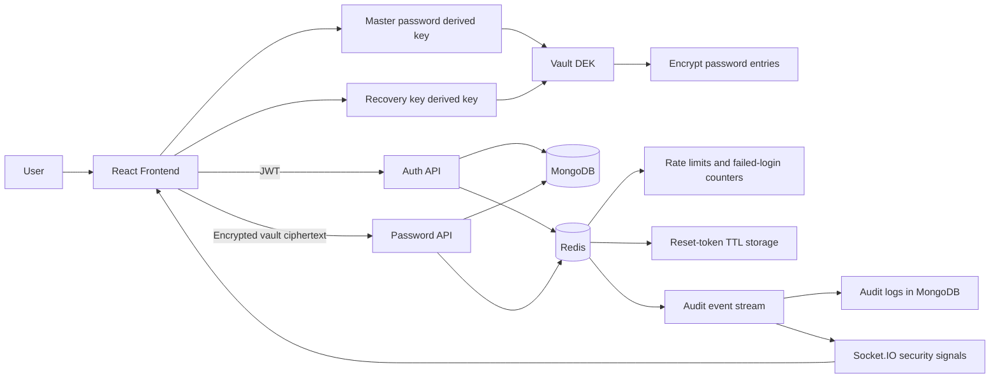
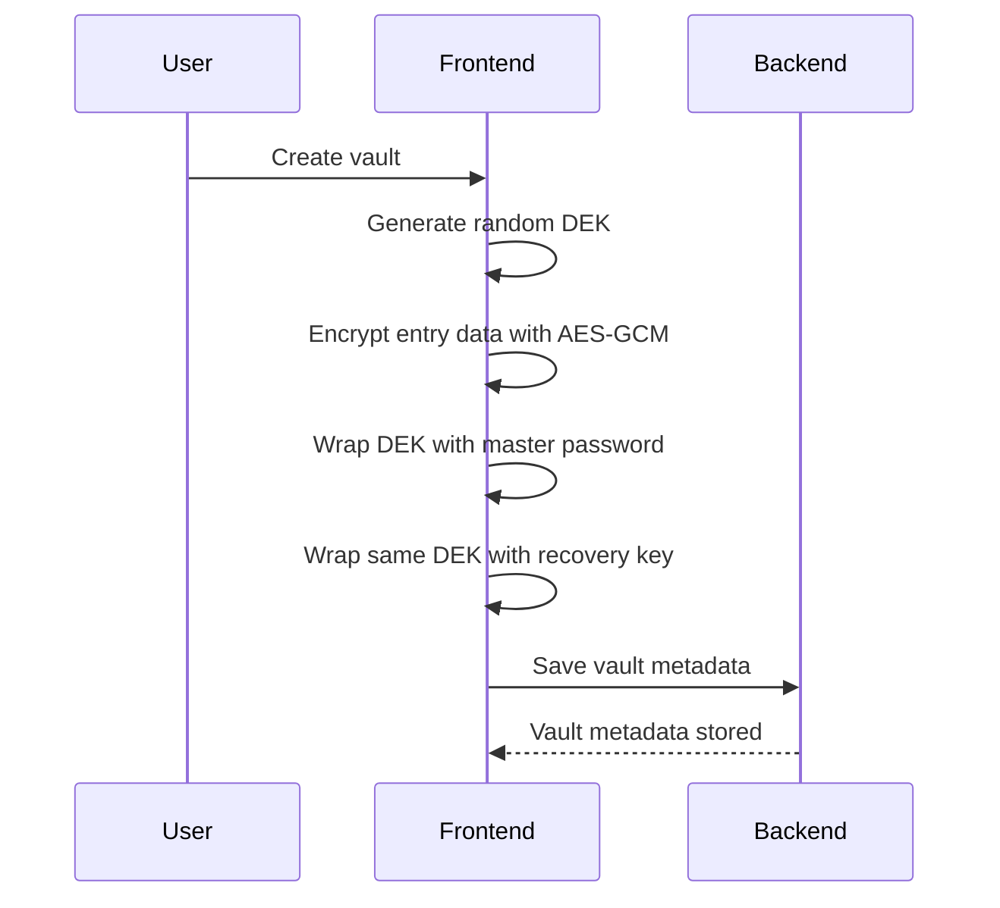
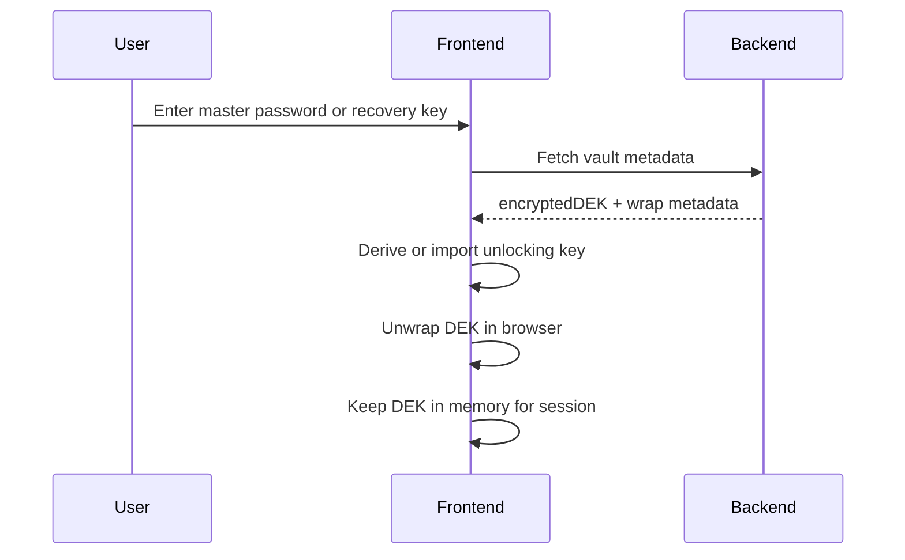
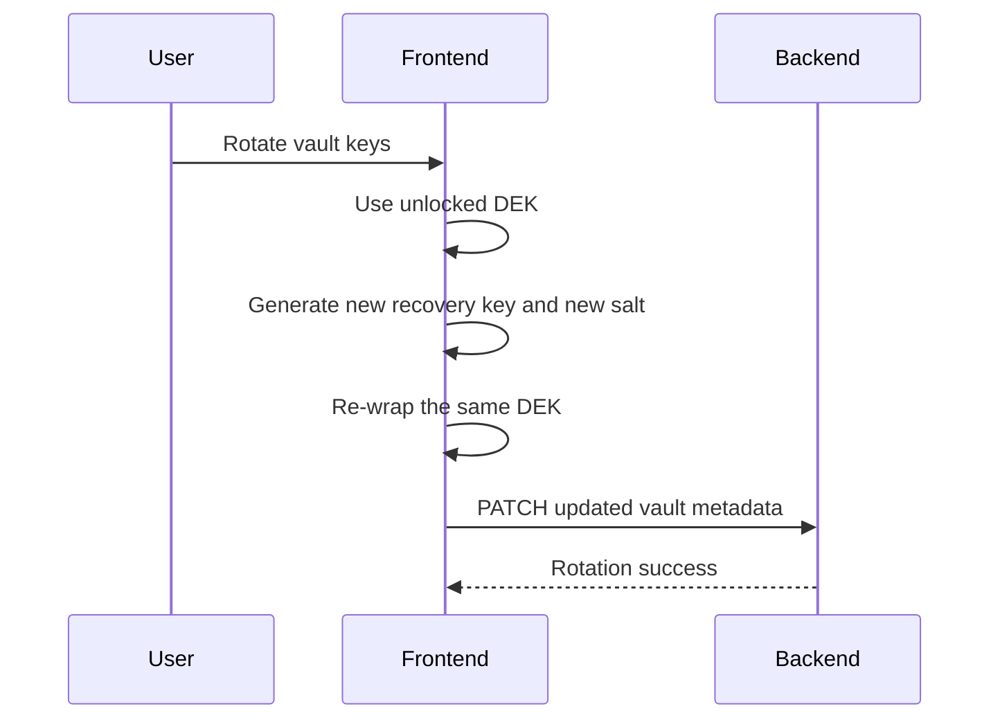

# Architecture

KeyMate's updated architecture separates authentication from vault encryption and adds Redis as a fast security and event-processing layer between the API and longer-lived storage.

## Core Concepts

- **DEK**: Data Encryption Key used to encrypt vault entries.
- **Master password**: Used to derive a wrapping key that protects the DEK.
- **Recovery key**: Alternate unlock path that wraps the same DEK.
- **Key rotation**: Re-wraps the same DEK with new key material without re-encrypting entries.
- **Redis security layer**: Handles short-lived counters, reset-token TTL, and the audit-event stream.
- **Live security signals**: Safe frontend notifications emitted from sanitized audit events over Socket.IO.

## High-Level Flow

## Vault Setup

## Unlock Flow

## Rotation Flow

## Redis Responsibilities

- rate limits registration, login, and forgot-password requests
- tracks repeated failed logins by identifier and IP
- stores password reset tokens with TTL
- queues sanitized audit events for asynchronous processing
- feeds live safe security signals to the frontend through the audit worker

## Storage Boundaries

- **MongoDB stores**: users, vault metadata, ciphertext password entries, persisted audit logs
- **Redis stores**: counters, expiring reset-token data, audit stream events
- **Browser memory/session stores**: unwrapped DEK, active vault-unlock state, pending recovery-key reveal
