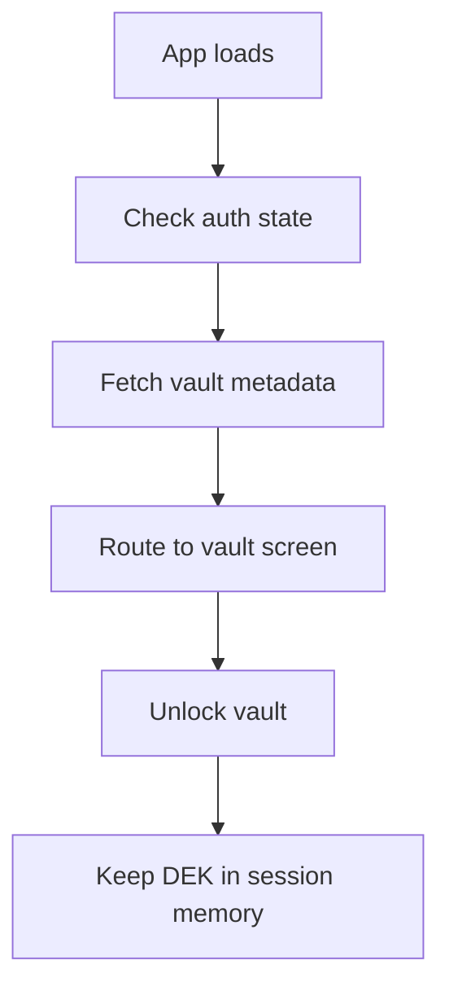

# Frontend Guide

## Main Entry Points

- `src/main.jsx` boots React and mounts the app.
- `src/App.jsx` defines routes and vault bootstrap behavior.
- `src/Store/store.js` configures Redux.

## Important Screens

- Home and hero section
- Authentication pages
- Vault key management page
- Password list, add, and details pages

## Vault UI Flow

## Password UX

- Strength checker shows missing password requirements.
- Password inputs include a show/hide toggle.
- Suggested strong passwords can be copied or applied.

## State Management

- Auth tokens live in `localStorage`.
- Vault metadata lives in Redux.
- The unlocked DEK is kept in memory for the current session.

