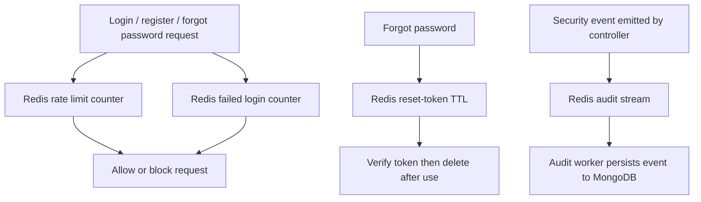

# Redis Guide

Redis is used as a fast, temporary security layer for the backend.

## What Redis Does

- rate limits registration, login, and forgot-password requests
- tracks failed login attempts by user identifier and IP
- stores password reset tokens with automatic expiry
- queues audit events through a Redis stream for asynchronous persistence

## What Redis Does Not Store

- master passwords
- recovery keys
- unwrapped DEKs
- plaintext password entries

## Local Setup

### Option 1: Docker

```bash
docker run -d --name redis -p 6379:6379 redis
```

### Backend env

```env
REDIS_URL=redis://localhost:6379
```

## Production Setup on Render

1. Create a Render **Key Value** instance.
2. Put it in the same region as the backend.
3. Copy the **internal connection URL**.
4. Set that URL as `REDIS_URL` in the Render backend service.
5. Redeploy the backend.

The frontend on Vercel does not connect to Redis directly.

## How It Is Used



## Safety Note

If Redis is unavailable in local development, the app can continue running, but Redis-backed protections will be weaker or disabled.
