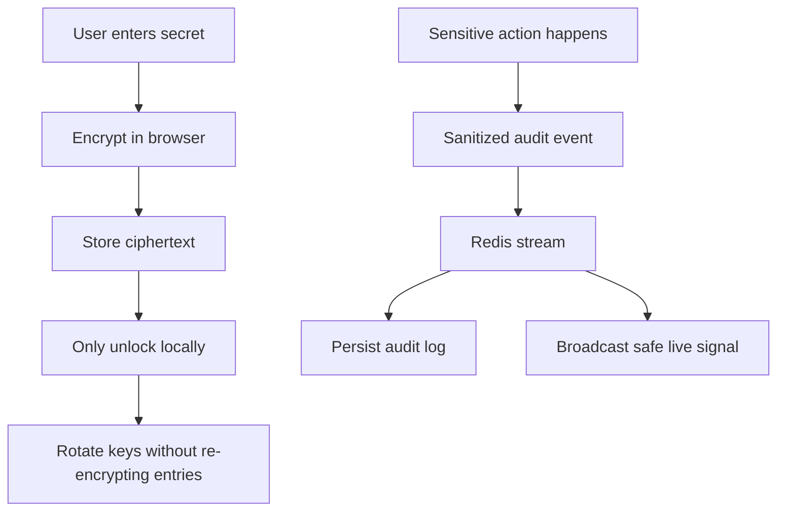

# Security Model

## Current Security Layers

- JWT-based authentication for app sessions
- Client-side vault encryption model
- Master password protecting the vault DEK
- Recovery key fallback
- Key rotation for vault wrapping material
- Password strength guidance in the UI
- Redis-backed auth protections
- Audit logging for sensitive account and vault actions
- Real-time security signals delivered over authenticated sockets

## What Should Stay Secret

- Master password
- Recovery key
- Unwrapped DEK
- Plaintext password entries

## Security Goals

## Live Signal Rules

- Socket connections are authenticated with the existing JWT
- Each socket joins a per-user room on the backend
- Only sanitized, allowlisted event metadata is broadcast
- Secrets such as passwords, ciphertext, DEKs, tokens, and recovery material are never emitted

## Current Live Signals

- `login_from_new_device`
- `vault_unlock_failed_multiple`
- `recovery_key_regenerated`
- `vault_rotated`
- `login_success`
- password create, update, and delete activity

## Future Improvements

- clipboard timeout
- auto-lock on inactivity
- trusted device management
- device revocation
- optional account 2FA
