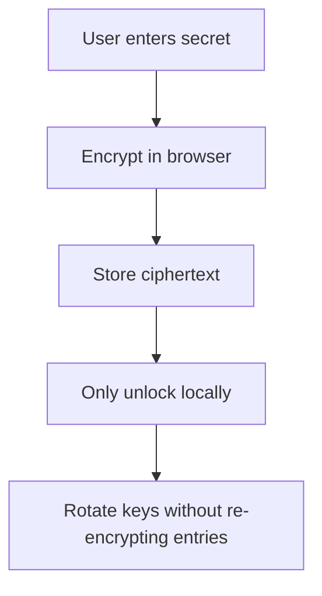

# Security Model

## Current Security Layers

- JWT-based authentication for app sessions
- Client-side vault encryption model
- Master password protecting the vault DEK
- Recovery key fallback
- Key rotation for vault wrapping material
- Password strength guidance in the UI

## What Should Stay Secret

- Master password
- Recovery key
- Unwrapped DEK
- Plaintext password entries

## Security Goals

## Future Improvements

- clipboard timeout
- auto-lock on inactivity
- trusted device management
- device revocation
- audit log
- optional account 2FA

